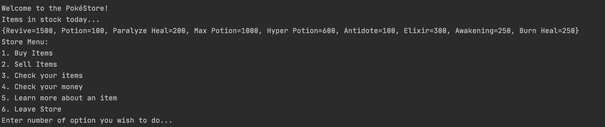
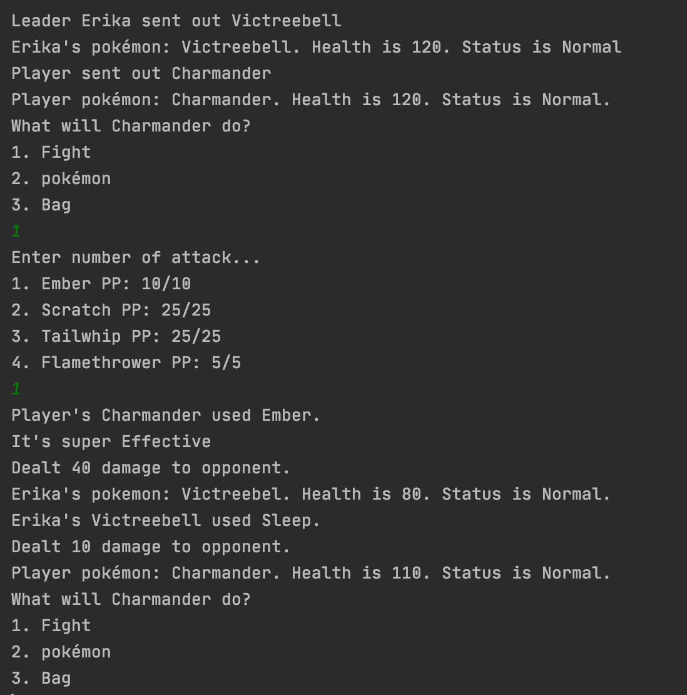
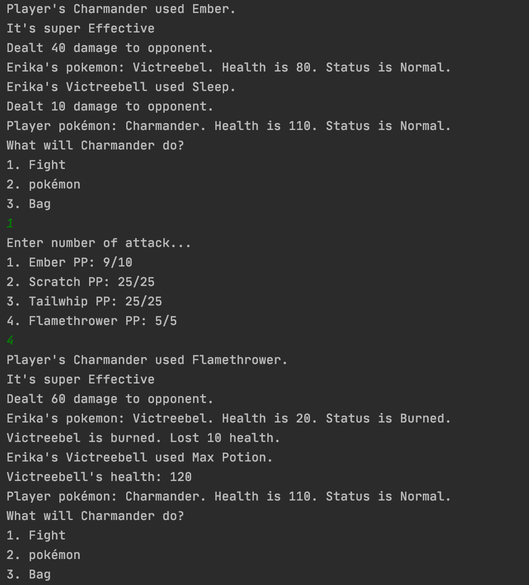
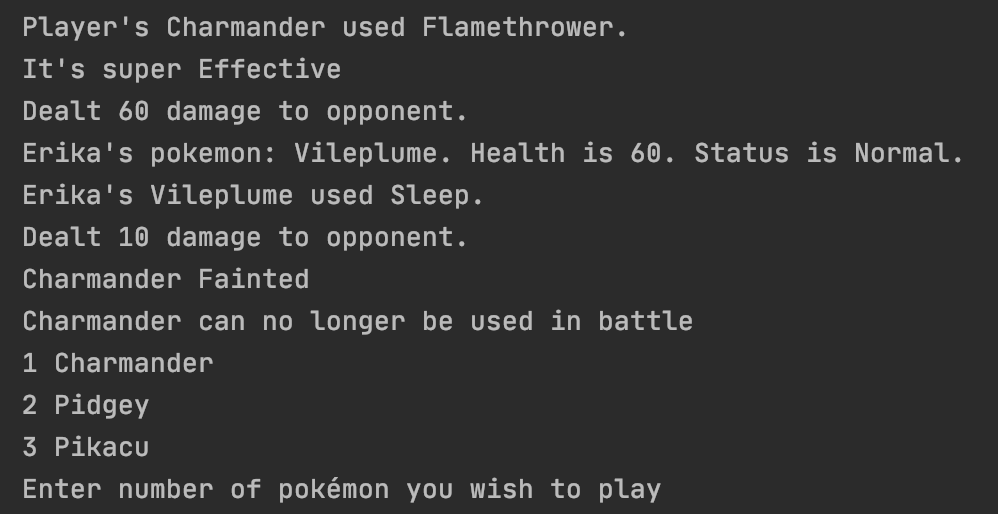

# Pokemon Game
This pokemon game is a text based pokemon battle simutlation game. It allows users to pick thier own pokemon, buy items to use in battle and fight through 4 gym leaders and their rival. Combat consist of a turn based system and Enemy AI that returns move based on pokemon's health and health, status and type of enemy. The game features numerous classes which facilitate an object-oriented approach to a text based battle game. 

